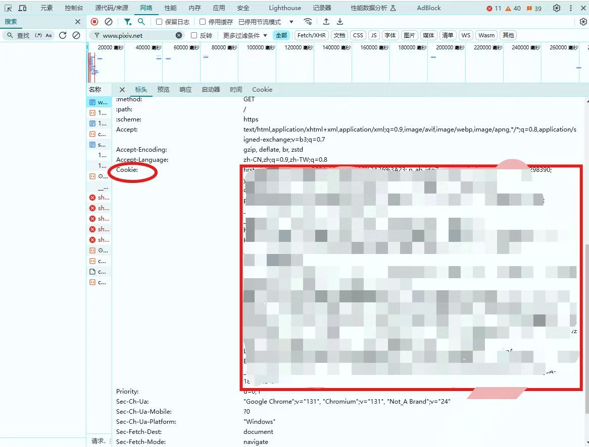

# pixiv-novel-download
下载保存pixiv小说（单篇、系列），自用。

## 安装依赖
```bash
pip install selenium webdriver_manager docx
```

## 获取cookie
- 1、访问[https://www.pixiv.net/](https://www.pixiv.net/)，登录账号。
- 2、F12打开浏览器调试，刷新页面。
- 3、在调试页面网络选项卡下，选择下图所示的项目并单击显示详情，完整复制cookie部分。


- 4、打开cookie.txt文件，使用cookie覆盖文件内容即可。

## 下载小说
### 单篇下载
- 运行novel.py文件，输入小说id并回车即可下载。


### 系列下载
- 运行series_mt.py(多线程)、series.py(单线程)，输入系列id并回车即可下载。


- 下载会在当前目录下生成以系列名命名的文件夹，系列小说将保存在对应文件夹下。
- 多线程下载已修改为图形界面，可自定义系列文件夹位置，推荐使用。
